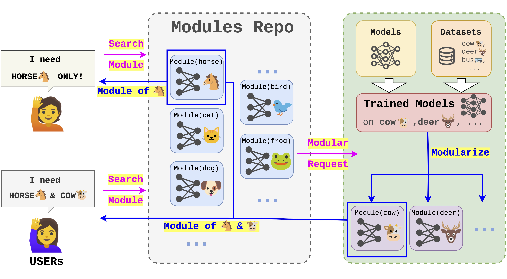

# ModelFoundry

A Tool for DNN Modularization to Support On-demand Model Reuse

MORE RESULTS can be seen in :

```bash
/results/README.md
```

## Abstract

DNN model reuse is a popular way to improve the efficiency of model construction, particularly with the massive models available on sharing platforms (e.g., HuggingFace). Recently, on-demand model reuse has drawn much attention, which aims to reduce the overhead and safety risk of model reuse via decomposing models into modules and reusing modules according to user's requirements. However, existing efforts for on-demand model reuse stop at algorithm implementations. These implementations involve ad-hoc decomposition in experiments and require considerable manual effort to adapt to new models; thus obstructing the practicality of on-demand model reuse.  In this paper, we introduceModelFoundry, a tool that systematically integrates two modularization approaches proposed in our prior work.  ModelFoundry provides automated and scalable model decomposition and module reuse functionalities, making it more practical and easily integrated into model sharing platforms. Evaluations conducted on widely used models sourced from PyTorch and GitHub platforms demonstrate thatModelFoundry achieves effective model decomposition and module reuse, as well as scalability to various models.

## Requirements

**This tool should be deployed on Linux with Nvidia GPU**

**For WebUI:**

- node v16.20.2
- npm v8.19.4
- vue v2.6.11

**For server:**

- Python v3.8.10
- Pytorch v1.8.1+cu111
- Torchvision v0.9.1+cu111
- Torchaudio v0.8.1
- Argparse v1.4.0
- Flask v3.0.0
- Werkzeug v3.0.0
- GPU with CUDA support

## Structure of the directories

```
[todo]
```

## How to use

### For Docker Launch

Docker images can be found in:

https://hub.docker.com/repository/docker/bxh1/modelfoundry

To get the docker images, run:

```bash
docker pull bxh1/modelfoundry:frontend_V2.1
docker pull bxh1/modelfoundry:backend_V2.1
```
**IMPORTANT:** mount the data in docker-compose.yml volumes:

```yaml
# Mount your data from "https://mega.nz/file/tX91ACpR#CSbQ2Xariha7_HLavE_6pKg4FoO5axOPemlv5J0JYwY" to /app/GradSplitter_main/data
    - /data/bixh/ToolDemo_GS/GradSplitter_main/data:/app/GradSplitter_main/data
# Mount your data from "https://mega.nz/folder/ADMjESyC#LkCOzE0qVHs8DOXkN3l_WA" to /app/SeaM_main/data
    - /data/bixh/ToolDemo_GS/SeaM_main/data:/app/SeaM_main/data
# If downloading trained models takes much time, please mount it to: /root/.cache/torch/hub/checkpoints
    - /data/bixh/ToolDemo_GS/checkpoints:/root/.cache/torch/hub/checkpoints
# And please mount your Imagenet dataset to /app/SeaM_main/data/dataset
    - /data/qibh/others/ILSVRC2012:/app/SeaM_main/ILSVRC2012
```

**Docker compose file can be found in this Repo**

To launch docker images and save logs, use:

```bas
docker-compose up >logs.txt
```

### Launch from source code

The tool is divided into two parts.

###  For WebUI:

```bash
cd vue_project
```

To install requirements, please run:

```bash
npm install
```

And for running the web UI:

```bash
npm run serve
```

### For server:

```bash
cd flask_project
```

Python 3.8 and GPU with CUDA is required.

To install requirements, run

```ba
pip install -r requirements.txt
```

And start the server:

```ba
flask run
```

## Data

Move [Data](https://mega.nz/file/tX91ACpR#CSbQ2Xariha7_HLavE_6pKg4FoO5axOPemlv5J0JYwY) to:

```bash
ModelFoundry/flask_project/GradSplitter_main/data
```

Move [Data](https://mega.nz/folder/ADMjESyC#LkCOzE0qVHs8DOXkN3l_WA) to:

```bash
ModelFoundry/flask_project/SeaM_main/data
```

## Architecture



## UI design

As shown in Figure below, the user interface of ModelFoundry is designed to be simple and intuitive. A user first searches for the required module and confirms which dataset the module comes from by viewing the module card. Then, the user specifies the model that needs to be decomposed. \projectName will directly evaluate the module and make download function available when the module exists. Next, the user can select the target task and click the **Modularize** button to send the task configurations to the server to execute the corresponding pipeline. The results will be sent back to the log box of the web interface, showing the evaluation of the decomposition. The decomposed modules can be downloaded by clicking **download**, or by clicking **reuse** to perform the reuse function we offer. 


